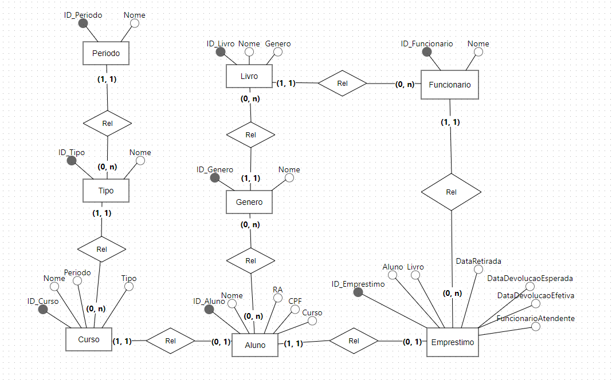
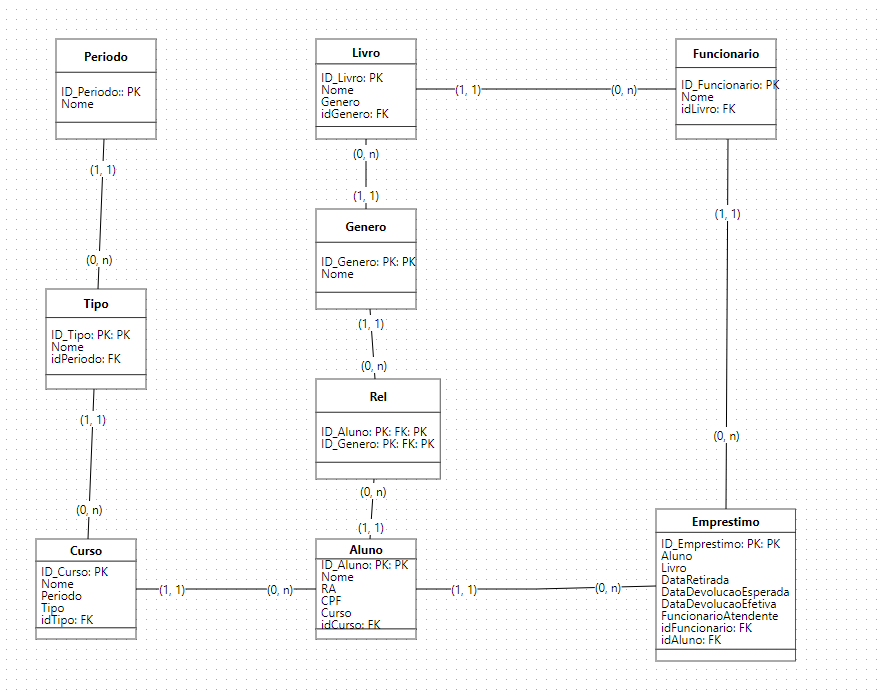
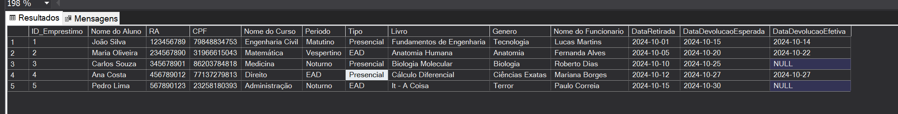

# USFBiblioteca Database

Este documento descreve o banco de dados **USFBiblioteca**, projetado para gerenciar informações de uma biblioteca acadêmica. O banco de dados possui várias tabelas inter-relacionadas, cada uma com um propósito específico para armazenar dados sobre cursos, alunos, livros e empréstimos.

## Estrutura do Banco de Dados

### Modelo Conceitual

### Modelo Lógico

## Modelo Físico

### Tabela `Periodo`
Armazena informações sobre os períodos dos cursos.

- **ID_Periodo**: `INT` - Identificador único do período (chave primária).
- **Nome**: `VARCHAR(50)` - Nome do período (ex.: "Matutino", "Noturno").

### Tabela `Tipo`
Define o tipo do curso.

- **ID_Tipo**: `INT` - Identificador único do tipo (chave primária).
- **Nome**: `VARCHAR(50)` - Nome do tipo (ex.: "Bacharelado", "Licenciatura").

### Tabela `Curso`
Contém informações sobre os cursos oferecidos.

- **ID_Curso**: `INT` - Identificador único do curso (chave primária).
- **Nome**: `VARCHAR(50)` - Nome do curso (ex.: "Engenharia de Software").
- **ID_Periodo**: `INT` - Chave estrangeira que referencia `Periodo(ID_Periodo)`.
- **ID_Tipo**: `INT` - Chave estrangeira que referencia `Tipo(ID_Tipo)`.

### Tabela `Aluno`
Armazena informações sobre os alunos matriculados.

- **ID_Aluno**: `INT` - Identificador único do aluno (chave primária).
- **Nome**: `VARCHAR(50)` - Nome do aluno.
- **RA**: `CHAR(9)` - Registro acadêmico do aluno.
- **CPF**: `CHAR(11)` - CPF do aluno.
- **ID_Curso**: `INT` - Chave estrangeira que referencia `Curso(ID_Curso)`.

### Tabela `GeneroLivro`
Define os gêneros dos livros.

- **ID_Genero**: `INT` - Identificador único do gênero (chave primária).
- **Nome**: `VARCHAR(50)` - Nome do gênero (ex.: "Ficção", "Ciência").

### Tabela `Livro`
Contém informações sobre os livros disponíveis na biblioteca.

- **ID_Livro**: `INT` - Identificador único do livro (chave primária).
- **Nome**: `VARCHAR(50)` - Título do livro.
- **ID_Genero**: `INT` - Chave estrangeira que referencia `GeneroLivro(ID_Genero)`.

### Tabela `Emprestimo`
Registra os empréstimos de livros realizados por alunos.

- **ID_Emprestimo**: `INT` - Identificador único do empréstimo (chave primária).
- **Data_Emprestimo**: `DATE` - Data do empréstimo.
- **Data_Devolucao**: `DATE` - Data de devolução do livro.
- **ID_Livro**: `INT` - Chave estrangeira que referencia `Livro(ID_Livro)`.
- **ID_Aluno**: `INT` - Chave estrangeira que referencia `Aluno(ID_Aluno)`.

## Relacionamentos Entre as Tabelas

- `Curso` está relacionado com `Periodo` e `Tipo` através de chaves estrangeiras.
- `Aluno` está associado a um `Curso`, indicando o curso em que o aluno está matriculado.
- `Livro` possui um gênero associado por meio da tabela `GeneroLivro`.
- `Emprestimo` conecta `Aluno` e `Livro`, registrando cada empréstimo feito.

## Tabelas

## Observações
Este banco de dados permite registrar informações essenciais para uma biblioteca acadêmica, incluindo os livros disponíveis, os alunos que realizam empréstimos, e o histórico de empréstimos.

## Instruções para Uso
1. Execute o script SQL para criar o banco de dados e as tabelas associadas.
2. Utilize consultas SQL para inserir, atualizar e consultar dados conforme necessário.

---

Este banco de dados foi desenvolvido como parte de uma atividade avaliativa do curso de Engenharia de Software.
